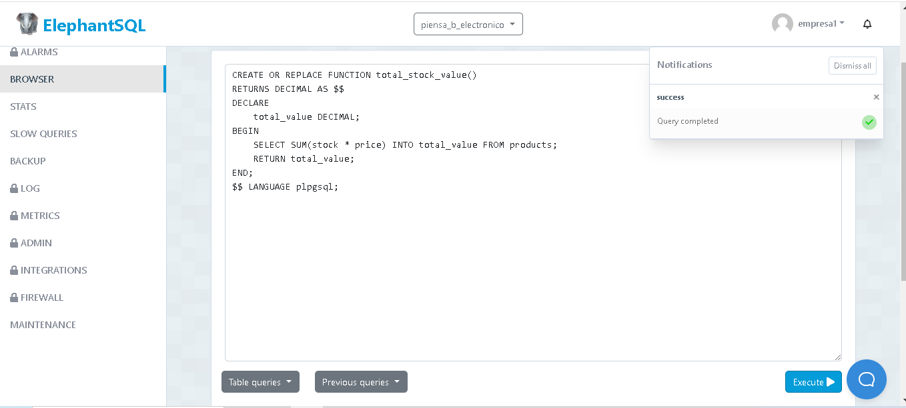
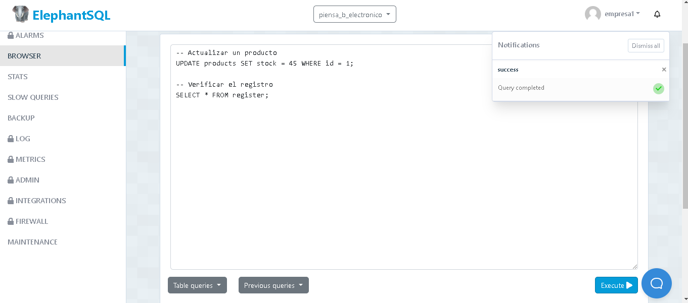
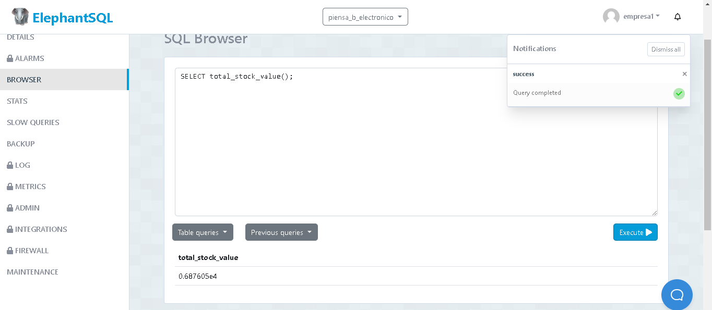

1.- Crear la función que será llamada por el disparador
CREATE OR REPLACE FUNCTION log_product_update()
RETURNS TRIGGER AS $$
BEGIN
    INSERT INTO register (created_at, type_register, qty, product_id, user_id)
    VALUES (CURRENT_TIMESTAMP, 'UPDATE', NEW.stock, NEW.id, 1); -- Aquí el user_id es 1 por defecto, puede ser modificado según sea necesario
    RETURN NEW;
END;
$$ LANGUAGE plpgsql;

-- Crear el disparador que llama a la función anterior
CREATE TRIGGER product_update_trigger
AFTER UPDATE ON products
FOR EACH ROW
EXECUTE PROCEDURE log_product_update();

<img src="" 

2.-A continuación, creamos una función que calcule el valor total del stock en la tabla 

CREATE OR REPLACE FUNCTION total_stock_value()
RETURNS DECIMAL AS $$
DECLARE
    total_value DECIMAL;
BEGIN
    SELECT SUM(stock * price) INTO total_value FROM products;
    RETURN total_value;
END;
$$ LANGUAGE plpgsql;
<img src="" 

3.-Ahora puedes actualizar un producto y ver el registro en la tabla register:

-- Actualizar un producto
UPDATE products SET stock = 45 WHERE id = 1;

-- Verificar el registro
SELECT * FROM register;
<img src="" 

4.- cñlcular stock

SELECT total_stock_value();
<img src="" 